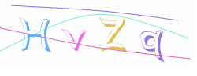

<div align=center></div>

# webman-scaptcha
- 使用`PHP`生成`SVG`格式的验证码
- 需要`PHP`大于`8.0`
- 需要安装redis
- 现已支持缓存字形，提高了在字体文件过大，导致生成验证码过慢的问题

<p>
    <a href="https://packagist.org/packages/isszz/webman-scaptcha">=8.0-8892BF.svg" alt="Minimum PHP Version"></a>
    <a href="https://packagist.org/packages/isszz/webman-scaptcha">=1.4-8892BF.svg" alt="Minimum Webman Version"></a>
    <a href="https://packagist.org/packages/isszz/webman-scaptcha"></a>
    <a href="https://packagist.org/packages/isszz/webman-scaptcha"></a>
    <a href="https://packagist.org/packages/isszz/webman-scaptcha"></a>
    <a href="https://packagist.org/packages/isszz/webman-scaptcha"></a>
</p>


## 避坑
- 每个文字首次载入时还是需要读取字体，所以在使用英文，数字的情况缓存下来还是挺快的，因为文字种类比较少，能很快缓存下来  
- 如果自行配置`char`为中文，使用中文验证码时，请务必确认所使用字体包含该汉字，并且需要配置`font`参数为中文字体路径
- 建议生产环境尽量使用缓存后的字形，提高生成验证码的速度

## 安装

```shell
composer require isszz/webman-scaptcha
```

> 如果需要添加字体，放入tp根目录下config/fonts目录即可，更改配置fontName=字体文件名

## 配置

```php
return [
    'type' => null, // 单独的配置项
    'cache' => true, // 是否启用字形缓存
    'api' => false, // 是否是API模式
    // 设置为true时不管验证对错, 都会删除存储凭证，若验证失败则需要刷新一次验证码
    // 设置为false时, 直到验证输入正确时, 才删除存储凭证，也就是允许试错
    'disposable' => false,
    'width' => 150, // 宽度
    'height' => 50, // 高度
    'noise' => 5, // 干扰线条的数量
    'inverse' => false, // 反转颜色
    'color' => true, // 文字是否随机色
    'background' => '', // 验证码背景色
    'size' => 4, // 验证码字数
    'ignoreChars' => '', // 验证码字符中排除
    'fontSize' => 52, // 字体大小
    'char' => 'ABCDEFGHIJKLMNOPQRSTUVWXYZabcdefghijklmnopqrstuvwxyz0123456789', // 预设随机字符
    'math' => '', // 运算模式：1=加法，2=减法，3=乘法，4=除法，或非1=4，则随机四种
    'mathMin' => 1, // 用于计算的最小值
    'mathMax' => 9, // 用于计算的最大值
    'font' => '', // 用于验证码的字体文件路径, 建议字体文件不超过3MB

    // API模式，使用token机制，使用这里的配置后API会携带一个token，在验证时需要携带token和输入的code进行验证
    /*'token' => [
        // 也可以自定义\app\common\libs\MyStore::class,
        // 自带可选：redis，session；建议使用redis
        'store' => 'cache', 
        'expire' => 300,
        'redis' => [
            'host' => '127.0.0.1',
            'port' => 6379,
            'password' => '',
            'select' => 1,
            'timeout' => 0,
        ],
    ],*/

    // 单独的配置, 会覆盖上面的配置
    'test' => [
        'noise' => 3,
        'color' => false,
        'char' => '0123456789',
        // 'token' => null,
    ],
];
```
#### 支持的url参数配置

`url`配置参数优先级最高

```shell
/scaptcha/t/单独的配置名
         /m/运算模式：1=加法，2=减法，3=乘法，4=除法，或随机四种
         /w/宽度
         /h/高度
         /s/字体大小
         /l/非运算模式时，文字数量
         /n/干扰线条数量
         /c/文字是否随机色
         /b/背景颜色
         /cs/api模式输出格式1=svg，2=base64
         /rt/禁用缓存字形，生产模式不建议禁用
         /reset/删除已缓存字形，不建议在生产模式一直加在url参数中，否则字形缓存无效，字体文件超过3MB会比较慢
```

## 使用方法


`composer`安装后可直接访问`/scaptcha`路径访问验证码，默认获取的是json格式:
```php
{
    'code': 0,
    'msg': 'success',
    'token': '8SOy2KSfcSVIP7qTogFCLvLZb9tj5eTB', // API模式，使用token机制否则返回null
    'svg': 'data:image/svg+xml,.../%3E%3C/svg%3E',
}

```

访问`/scaptcha/svg`时获取到的是可渲染的svg：
```html
<svg xmlns="...."></svg>
```

非必要情况，可使用组件自己注册的路由地址使用


### 快捷助手函数

tp模板文件中使用

```html
<!-- 第一个参数为配置项，可参考URL参数配置，第二个参数用来设置domID -->
<div>{:scaptcha_img(['l' => 3], 'J_captcha')}</div>

```
或者

```html
<!-- 配置项参考URL参数配置 -->
<?php
    $captchaSrc = scaptcha_src([
        'l' => 5,
    ]);
?>


```
如果是API方式调用
```php
[$token, $image] = scaptcha_api([
    'noise' => 3, // 3条干扰线
    'color' => false, // 灰色模式
    'char' => '0123456789', // 数字验证码
]);

// 或指定单独的配置，第二个参数用于选择生成的格式false=svg，true=base64
[$token, $image] = scaptcha_api('test', true);
```

### 若需要自行在控制器输出验证码🌰

```php
use support\Request;
use isszz\captcha\Captcha;

class CaptchaController
{
    /**
     * 获取验证码, 用于api
    */
    public function index(Request $request)
    {
        return json([
            'code' => 0,
            'data' => scaptcha_api(),
            'msg' => 'success',
        ]);
    }

    /**
     * 直接显示svg验证码
    */
    public function svg()
    {   
        $content = scaptcha();
        
        return response($content, 200, [
            'Content-Type' => 'image/svg+xml',
            'Content-Length' => strlen($content),
        ]);
    }

    /**
     * 验证输入验证码是否正确|输出json
    */
    public function check($code, string|null $token = null)
    {
        $json = [
            'code' => 0,
            'msg' => 'success',
            'data' => null,
        ];

        if(!scaptcha_check($code, $token)) {
            $json['code'] = 1;
            $json['msg'] = 'error';
        }

        return json($json);
    }
}

```

## 验证
使用组件注册的验证地址验证
```shell
# POST提交
/scaptcha/check?code=xxx
// 如果是API模式
/scaptcha/check?code=输入验证码&token=接口返回的token字段

// 返回
{
    'code': 0, // 0=验证成；1=验证失败；2=未提交验证码；3=验证码组件报错，请issue
    'msg': 'success',
}
```
或者使用助手函数手动验证
```php
if(!scaptcha_check($code, $token)) {
    // 验证失败
}
```

## 本组件基于以下开源库

- php字体库: [PhenX/php-font-lib](https://github.com/PhenX/php-font-lib)
- svg-captcha nodejs版: [lichaozhy/svg-captcha](https://github.com/lichaozhy/svg-captcha)
